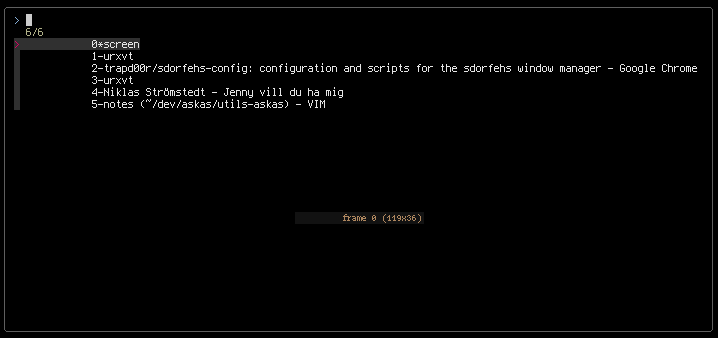

sdorfehs configuration and scripts
----------------------------------


- **sdorfehsrc**: The configuration file.

- **sdorfehs-feedbar**:
A loop that runs the main sdorfehs-bar.pl script, feeding information to
the sdorfehs bar through a named pipe.

- **sdorfehs-bar.pl**
This is where all the magic happens.

- **mpd-goto-album-dir**
This script is executed when clicking the album name on the sdorfehs now
playing data. A terminal is spawned where the shell CWD is set to the path of the album.

- **mpd-goto-artist-dir**
This script is executed when clicking the artist name on the sdorfehs now
playing data. A terminal is spawned where the shell CWD is set to the path of the artist.
- **mpd-copy-path-to-clipboard**
This script is executed when clicking the song title on the sdorfehs now playing data.
The full path of the song is placed in the PRIMARY clipboard.

- **fzfselect**, **fzfvselect**
Interactive window and vscreen switcher using fzf.




- **sselectt_skip_top_monitor**
Physical monitor switching, skipping the upper monitor in a setup like this:

```
  [  ]
[][  ][]
```
this allows for a sensible vim feel when switching monitors:

```
# left monitor
bind H exec sselect_skip_top_monitor left

# right monitor
bind L exec sselect_skip_top_monitor right

# middle monitor
bind J sselect 1

# top monitor
bind K sselect 2
```

Requirements
------------

- Term::ExtendedColor::Dzen - https://github.com/trapd00r/Term-ExtendedColor-Dzen
- Music::Beets::Info - https://github.com/trapd00r/Music-Beets-Info
- Audio::MPD
- Time::Date
- urxvt
- st
- fzf

Install and Usage
-------

```sh
$ cpanm Term::ExtendedColor::Dzen Audio::MPD Music::Beets::Info Time::Date
$ sh sdorfehs-feedbar &

